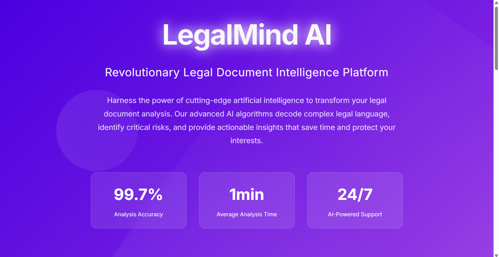
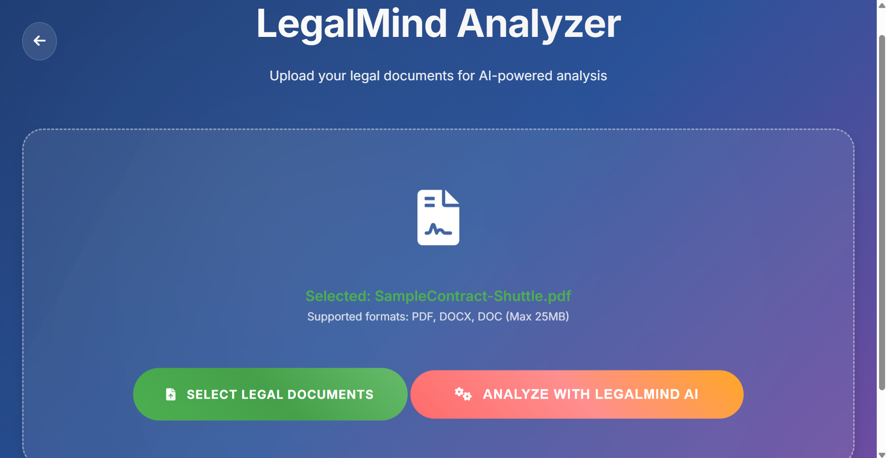
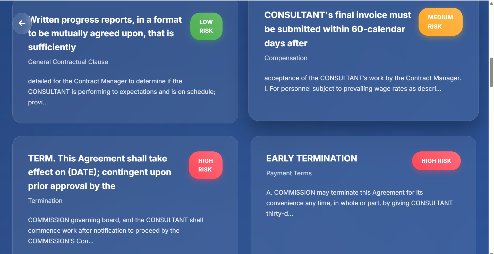
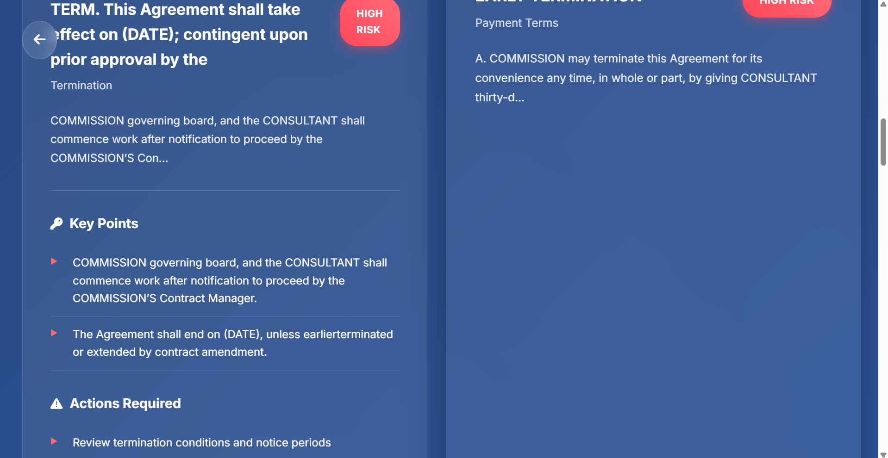
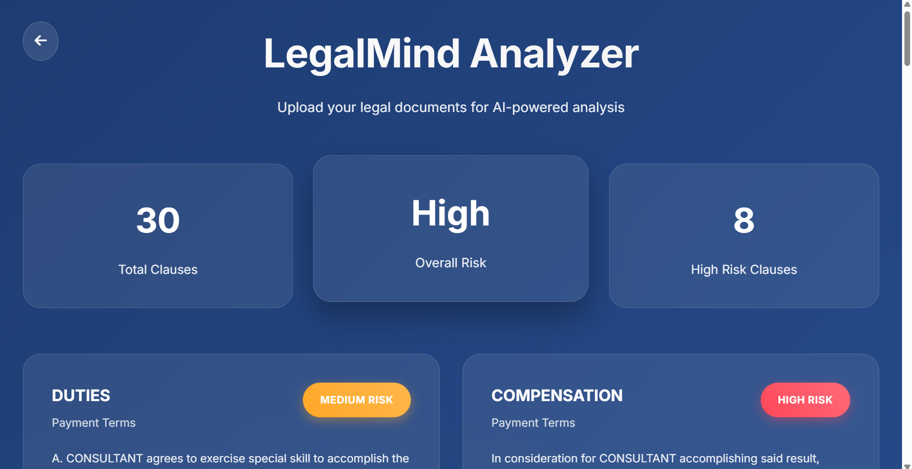

# 🧠 Legal Mind AI

**Legal Mind AI** is an intelligent legal document analysis system that leverages artificial intelligence to simplify legal document processing. This application enables users to upload legal documents, extract and classify clauses, match them against standard legal frameworks like LEDGAR, and generate plain-language explanations through an intuitive web interface.

---

## 📌 Project Overview

Legal Mind AI transforms complex legal document analysis into an accessible, user-friendly experience. The system combines advanced Natural Language Processing (NLP) with AI-powered clause classification to deliver comprehensive legal document insights.

This project consists of:
- **Frontend**: Custom-built responsive web interface using HTML, CSS, and JavaScript
- **Backend**: High-performance FastAPI server with specialized legal AI services
- **AI Integration**: Google Gemini API for natural language generation and explanations

---

## 🎯 Key Features

### 📄 Document Processing
- **PDF Upload & Analysis**: Seamless handling of legal documents in PDF format
- **Intelligent Clause Extraction**: Advanced NLP techniques to identify meaningful legal clauses
- **Document Structure Recognition**: Automatic parsing and text preprocessing

### 🔍 AI-Powered Analysis
- **Clause Classification**: Sophisticated categorization using trained legal AI models
- **LEDGAR Database Integration**: Cross-reference with standardized legal clause index
- **Contextual Understanding**: Deep analysis of clause relationships and legal implications

### 💬 Natural Language Generation
- **Plain Language Explanations**: Transform complex legal jargon into accessible summaries
- **Gemini API Integration**: Leverage Google's advanced AI for high-quality explanations
- **Legal Context Awareness**: Provide relevant insights and clause implications

### 🖥️ User Experience
- **Responsive Design**: Works seamlessly across desktop, tablet, and mobile devices
- **Intuitive Interface**: Clean, professional design with easy navigation
- **Real-time Processing**: Live updates during document analysis
- **Export Capabilities**: Download analysis results and explanations

---

## 🛠️ Technology Stack

### Frontend
| Technology | Purpose |
|------------|---------|
| **HTML5** | Semantic markup and document structure |
| **CSS3** | Responsive styling and modern UI design |
| **JavaScript (Vanilla)** | Dynamic interactions and API communication |

### Backend & AI
| Technology | Purpose |
|------------|---------|
| **FastAPI** | High-performance Python web framework |
| **Google Gemini API** | Advanced natural language processing |
| **PyPDF2** | PDF text extraction and processing |
| **Custom NLP Models** | Legal clause classification |
| **LEDGAR Integration** | Legal clause database matching |

### Development Tools
| Tool | Purpose |
|------|---------|
| **Python 3.8+** | Backend development |
| **Uvicorn** | ASGI server for FastAPI |
| **python-dotenv** | Environment variable management |
| **Requests** | HTTP client for API calls |

---

## 📸 Screenshots

### 🏠 Home Page
<!-- Add your home page screenshot here -->
 
*Clean, intuitive interface for document upload and analysis*

### 📄 Document Upload
<!-- Add your document upload screenshot here -->

*Drag-and-drop document upload with progress indication*

### 🔍 Analysis Results
<!-- Add your analysis results screenshot here -->

*Comprehensive clause extraction and classification results*

### 💬 AI Explanations
<!-- Add your AI explanations screenshot here -->

*Plain language explanations generated by Gemini AI*

### 📊 Classification Dashboard
<!-- Add your classification dashboard screenshot here -->

*Visual representation of clause types and classifications*

---

## 🚀 Getting Started

### Prerequisites
- Python 3.8 or higher
- Modern web browser (Chrome, Firefox, Safari, Edge)
- Google Gemini API key
- Git for version control

### 📥 Installation

1. **Clone the Repository**
   ```bash
   git clone https://github.com/Palaniyappan1104/Legal_Mind_AI.git
   cd Legal_Mind_AI
   ```

2. **Backend Setup**
   ```bash
   # Navigate to backend directory
   cd backend
   
   # Create virtual environment (recommended)
   python -m venv venv
   source venv/bin/activate  # On Windows: venv\Scripts\activate
   
   # Install dependencies
   pip install -r requirements.txt
   ```

3. **Environment Configuration**
   Create a `.env` file in the `backend/` directory:
   ```bash
   # Required: Gemini API Configuration
   GEMINI_API_KEY=your_gemini_api_key_here
   
   # Optional: Advanced Configuration
   GEMINI_MODEL=gemini-pro
   MAX_DOCUMENT_SIZE=10485760  # 10MB
   CLAUSE_EXTRACTION_TIMEOUT=30
   API_RATE_LIMIT=100
   ```

4. **Start the Backend Server**
   ```bash
   uvicorn app:app --reload --host 0.0.0.0 --port 8000
   ```

5. **Launch the Frontend**
   ```bash
   # Option 1: Direct file access
   # Open frontend/index.html in your browser
   
   # Option 2: Local server (recommended)
   cd ../frontend
   npx http-server -p 3000 -c-1
   
   # Option 3: Python simple server
   python -m http.server 3000
   ```

---

## 💡 How to Use

### Step 1: Access the Application
1. Open your web browser
2. Navigate to `http://localhost:3000` (if using local server)
3. Or open `frontend/index.html` directly in your browser

### Step 2: Upload Legal Document
1. Click the "Upload Document" button or drag and drop your PDF
2. Supported formats: PDF files up to 10MB
3. Wait for the upload confirmation

### Step 3: Analyze Document
1. Click "Analyze Document" to start processing
2. The system will:
   - Extract text from your PDF
   - Identify legal clauses using NLP
   - Classify clauses by type
   - Match against LEDGAR database
   - Generate AI explanations

### Step 4: Review Results
1. **Extracted Clauses**: View all identified legal clauses
2. **Classifications**: See categorized clause types
3. **AI Explanations**: Read Gemini-generated plain language summaries
4. **LEDGAR Matches**: Explore standardized clause comparisons

### Step 5: Export Results
1. Download analysis results as JSON
2. Save explanations for documentation
3. Export classifications for legal review

---

## 📁 Project Structure

```
Legal_Mind_AI/
├── 📁 frontend/                    # Client-side application
│   ├── 📄 index.html              # Main application page
│   ├── 🎨 style.css               # Styling and responsive design
│   ├── ⚡ script.js               # JavaScript functionality
│   └── 📁 assets/                 # Images and static resources
│       └── 📁 screenshots/        # Project screenshots
│
├── 📁 backend/                     # Server-side application
│   ├── 🚀 app.py                  # FastAPI main application
│   ├── 📁 services/               # Core business logic
│   │   ├── 🔍 clause_extraction.py        # PDF processing & extraction
│   │   ├── 🎯 clause_classification.py    # AI clause classification
│   │   ├── 💬 explanation_service.py      # Gemini API integration
│   │   └── 📊 ledgar_matching.py          # LEDGAR database operations
│   ├── 📁 models/                 # AI models and utilities
│   ├── 📁 utils/                  # Helper functions
│   ├── 🔐 .env                   # Environment variables (create this)
│   └── 📋 requirements.txt       # Python dependencies
│
├── 📊 gemini_quota.json          # API usage tracking
├── 📖 README.md                  # This documentation
└── 📄 LICENSE                    # MIT License
```

---

## 🔧 API Documentation

### Base URL
```
http://localhost:8000
```

### Endpoints

#### Document Analysis
```http
POST /analyze
Content-Type: multipart/form-data

Body:
- file: PDF file (required)
- analysis_type: "full" | "basic" (optional, default: "full")
```

#### Response Format
```json
{
  "document_id": "doc_12345",
  "status": "completed",
  "processing_time": "2.3s",
  "clauses": [
    {
      "id": "clause_1",
      "text": "The Party agrees to maintain confidentiality...",
      "classification": "Confidentiality",
      "confidence": 0.95,
      "ledgar_match": "CONF-001",
      "explanation": "This clause establishes confidentiality obligations..."
    }
  ],
  "summary": {
    "total_clauses": 15,
    "clause_types": ["Confidentiality", "Liability", "Termination"],
    "document_type": "Service Agreement"
  }
}
```

#### Health Check
```http
GET /health
```

#### Get Clause Details
```http
GET /clauses/{clause_id}
```

---

## 🌐 Deployment

### Frontend Deployment
Deploy the static frontend to:

#### **Netlify** (Recommended)
1. Connect your GitHub repository
2. Set build command: `# No build needed`
3. Set publish directory: `frontend/`
4. Deploy automatically on push

#### **Vercel**
1. Import your GitHub repository
2. Set root directory: `frontend/`
3. Deploy with zero configuration

#### **GitHub Pages**
1. Enable GitHub Pages in repository settings
2. Set source to `frontend/` directory
3. Access at `https://palaniyappan1104.github.io/Legal_Mind_AI/`

### Backend Deployment

#### **Render.com** (Recommended)
1. Create new Web Service
2. Connect your GitHub repository
3. Set build command: `pip install -r requirements.txt`
4. Set start command: `uvicorn app:app --host 0.0.0.0 --port $PORT`
5. Add environment variables (GEMINI_API_KEY)

#### **Railway**
1. Connect GitHub repository
2. Add environment variables
3. Deploy with automatic HTTPS

#### **Heroku**
1. Create new app
2. Add Python buildpack
3. Set environment variables
4. Deploy from GitHub

---

## 📊 Code Architecture

### Frontend Components
- **index.html**: Main application structure and layout
- **style.css**: Responsive design and visual styling
- **script.js**: API communication and user interactions

### Backend Services
- **app.py**: FastAPI application with route definitions
- **clause_extraction.py**: PDF processing and text extraction
- **clause_classification.py**: AI-powered clause categorization
- **explanation_service.py**: Gemini API integration for explanations
- **ledgar_matching.py**: Legal clause database operations

### Key Features Implementation
- **File Upload**: HTML5 File API with drag-and-drop
- **Real-time Updates**: WebSocket connections for live progress
- **Responsive Design**: CSS Grid and Flexbox for all screen sizes
- **API Integration**: Fetch API for backend communication

---

## 🧪 Testing

### Backend Testing
```bash
# Run all tests
cd backend
python -m pytest tests/ -v

# Run specific test file
python -m pytest tests/test_clause_extraction.py -v

# Run with coverage
python -m pytest tests/ --cov=services
```

### Frontend Testing
```bash
# If using testing framework
cd frontend
npm test

# Manual testing checklist
# - Document upload functionality
# - Analysis progress display
# - Results visualization
# - Export functionality
# - Mobile responsiveness
```

---

## 🤝 Contributing

We welcome contributions to Legal Mind AI! Here's how you can help:

### Development Setup
1. Fork the repository
2. Create a feature branch: `git checkout -b feature/amazing-feature`
3. Make your changes
4. Test thoroughly
5. Commit your changes: `git commit -m 'Add amazing feature'`
6. Push to the branch: `git push origin feature/amazing-feature`
7. Open a Pull Request

### Coding Standards
- **Python**: Follow PEP 8 style guidelines
- **JavaScript**: Use ESLint configuration
- **HTML/CSS**: Follow semantic HTML and BEM methodology
- **Documentation**: Update README and code comments

### Areas for Contribution
- **New Features**: Additional document types, advanced analytics
- **UI/UX**: Design improvements, accessibility enhancements
- **Performance**: Optimization, caching strategies
- **Testing**: Unit tests, integration tests, end-to-end tests

---

## 📄 License

This project is licensed under the MIT License. See the [LICENSE](LICENSE) file for details.

```
MIT License

Copyright (c) 2024 Palaniyappan S

Permission is hereby granted, free of charge, to any person obtaining a copy
of this software and associated documentation files (the "Software"), to deal
in the Software without restriction, including without limitation the rights
to use, copy, modify, merge, publish, distribute, sublicense, and/or sell
copies of the Software, and to permit persons to whom the Software is
furnished to do so, subject to the following conditions:

The above copyright notice and this permission notice shall be included in all
copies or substantial portions of the Software.
```

---

## 👨‍💻 Author

**Palaniyappan S**
- 🔗 GitHub: [@Palaniyappan1104](https://github.com/Palaniyappan1104)
- 📧 Email: [Contact via GitHub](https://github.com/Palaniyappan1104)
- 🌐 LinkedIn: [Connect with me](https://linkedin.com/in/palaniyappan-s)

---

## 🙏 Acknowledgments

- **Google Gemini API** for advanced natural language processing capabilities
- **LEDGAR Dataset** for providing standardized legal clause classifications
- **FastAPI Community** for excellent documentation and framework support
- **Legal AI Research Community** for advancing the intersection of law and technology
- **Open Source Contributors** for tools and libraries that make this project possible

---

## 📞 Support & Contact

### Getting Help
- 📝 **Issues**: [GitHub Issues](https://github.com/Palaniyappan1104/Legal_Mind_AI/issues)
- 💬 **Discussions**: [GitHub Discussions](https://github.com/Palaniyappan1104/Legal_Mind_AI/discussions)
- 📖 **Documentation**: This README and inline code documentation

### Reporting Issues
When reporting issues, please include:
1. Description of the problem
2. Steps to reproduce
3. Expected vs. actual behavior
4. Screenshots (if applicable)
5. Browser/environment information

---

## 🚀 Future Roadmap

### Planned Features
- **Multi-language Support**: Support for legal documents in various languages
- **Advanced Analytics**: Legal trend analysis and comparative studies
- **Integration APIs**: Connect with legal practice management systems
- **Collaboration Tools**: Team-based document review and annotation
- **Mobile Applications**: Native iOS and Android apps

### Technical Improvements
- **Performance Optimization**: Faster processing and better caching
- **Enhanced Security**: Advanced authentication and data protection
- **Scalability**: Support for high-volume document processing
- **AI Model Improvements**: Better accuracy and domain-specific models

---

## 🎯 Project Statistics

<!-- Add badges for build status, version, etc. -->


---

*Built with ❤️ for the legal technology community*

---

**Legal Mind AI** - *Transforming Legal Document Analysis with Artificial Intelligence*
